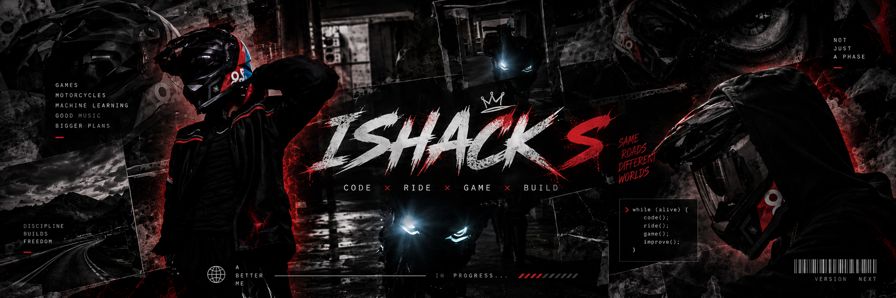

<div align="center">

<!-- Replace this with your custom GitHub banner:
     ./assets/ishack-banner.png -->



# ⚡ ISHACK S

### `CODE • RIDE • GAME • BUILD`


<br>


</div>

---

## 🧠 SYSTEM PROFILE

```text
┌─────────────────────────────────────────────────────────────┐
│                                                             │
│  USER        : ISHACK S                                     │
│  CLASS       : CSE STUDENT                                  │
│  MODE        : BUILD                                        │
│  MAIN QUEST  : GAME DEVELOPMENT                             │
│  SIDE QUEST  : MACHINE LEARNING                             │
│  PASSION     : MOTORCYCLES                                  │
│  STATUS      : ONLINE                                       │
│                                                             │
└─────────────────────────────────────────────────────────────┘
```

I'm a Computer Science & Engineering student who enjoys building things across **Machine Learning, AI, web development, automation and game development**.

Currently diving deeper into **Machine Learning**, while slowly working toward the bigger goal of becoming a **Game Developer**.

When I'm not writing code, I'm probably **gaming, riding, working on a project, or finding another thing to break and rebuild.**

---
### Main interests

- 🎮 Game Development
- 🧠 Game AI
- ⚙️ Gameplay Systems
- 🌎 Interactive Worlds
- 🤖 Machine Learning
- 💻 Software Engineering

My long-term goal is to build games and interactive experiences where **code actually feels like part of the experience**.

### Outside the terminal

**🏍️ Motorcycles**

**🎮 Games**

**🎧 Music**

**🔧 Random projects**

If it has a GPU, engine, keyboard or terminal, there's a good chance I'm interested.

---

# 🚀 PROJECTS

## 📅 Schel

**Smart scheduling & planning platform**

A schedule management application designed to help users organize tasks, plans and academic workflows.

**Stack:** `Next.js` `TypeScript` `Supabase`

---

## 🔗 Linkage

**Modern REST APIs × Legacy Banking Systems**

An integration gateway designed to bridge modern REST-based applications with legacy banking infrastructure.

### Core ideas

- API translation
- Idempotency
- Retry handling
- Error handling
- Observability

**Focus:** `FinTech` `Backend Systems` `API Architecture`

---

## 🤖 LogSmite

**GitHub automation & release assistant**

A GitHub App designed to automate changelog and release-note workflows.

**Focus:** `GitHub Apps` `Automation` `Developer Tools`

---

# ⚡ TECH STACK

<div align="center">

### LANGUAGES


### WEB / BACKEND


### AI / ML


### DATABASE / CLOUD


### TOOLS


</div>

---

# 🏆 HACKATHON LOG

```text
┌─────────────────────────────────────────────────────────────┐
│                     ACHIEVEMENT LOG                         │
├─────────────────────────────────────────────────────────────┤
│                                                             │
│  🥉  MathXplore Hackathon          → 3rd Place              │
│                                                             │
│  🥉  SDG Hackathon                → 3rd Place              │
│                                                             │
│  🏅  CyberStrike CTF              → Top 10                 │
│                                                             │
└─────────────────────────────────────────────────────────────┘
```

---

# 🧪 CURRENTLY LEARNING

```text
Machine Learning       ███████████░░░░░░░░
Game Development       ████████░░░░░░░░░░░
Deep Learning          █████░░░░░░░░░░░░░░
System Design           ██████░░░░░░░░░░░░░
```
---

# 🔥 CONTRIBUTION STREAK

<div align="center">


</div>
---

# 🐍 CONTRIBUTION SNAKE

<div align="center">


</div>

---

# 🧠 BUILD PHILOSOPHY

```text
┌─────────────────────────────────────────────────────────────┐
│                                                             │
│            "If it works, don't touch it."                   │
│                                                             │
│                         ↓                                   │
│                                                             │
│                     *touches it*                            │
│                                                             │
│                         ↓                                   │
│                                                             │
│                       "Fuck."                               │
│                                                             │
└─────────────────────────────────────────────────────────────┘
```

---

# 🌐 CONNECT

<div align="center">

<a href="https://github.com/ISHACK_S">

</a>

<a href="https://www.linkedin.com/in/ishack-s-45b423316/">

</a>

</div>

---

<div align="center">

### `🎮 CODE HARD • 🏍️ RIDE HARDER`

<br>


</div>
